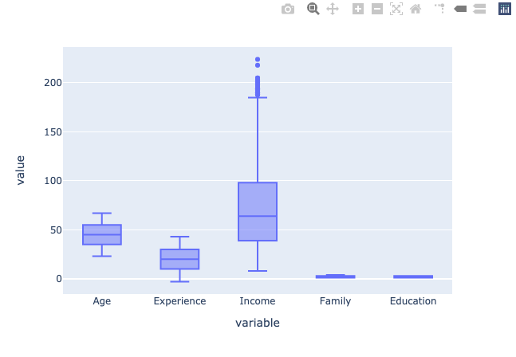
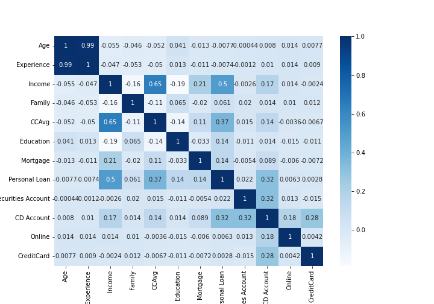
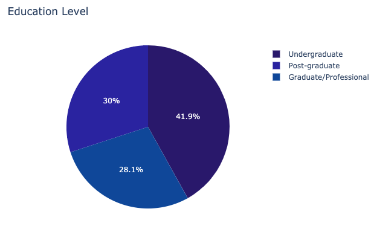
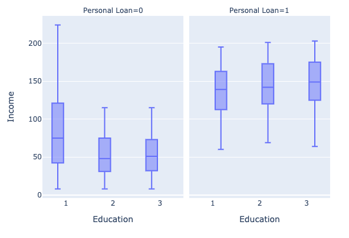
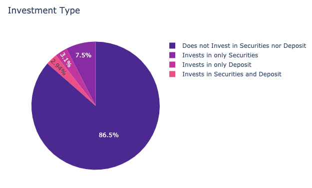
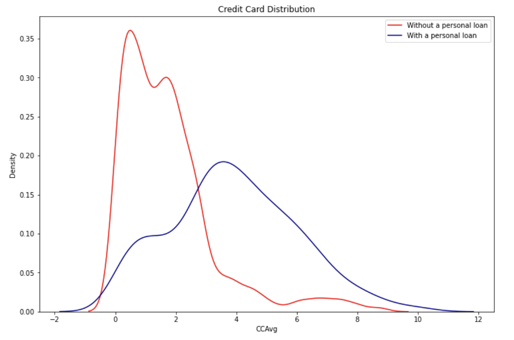
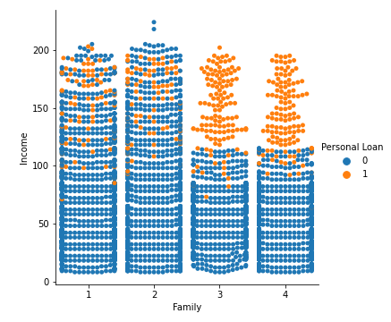

## Project Overview

- This project is created with the intention to determine which factor(s) influences clients to apply and accept a personal loan from the bank. 
- We found that an individual's annual income and the number of family members are the most important factors in determining whether an individual accepts a personal loan from the bank.
- The dataset can be obtained from Kaggle.
- The libraries involved in the project include: Pandas, Matplotlib, Seaborn, and Plotly
- [Link to this Project on Github](https://github.com/ewang58/Personal-Loan-Analysis/blob/master/Code/Finance_data_analysis.ipynb)

## Objectives

What is the most influential factors to receiving a personal loan from the bank?

## Data Cleaning and Organization

- Some nominal variables are eliminated (such as "ID" and "Zip Code").

- No missing data is found.

- Anomaly values, such as negative values in "Experience", are replaced with the mean

  

- As depicted in the graph, there is a large number of outliers in "income".

- The correlation in the attributes is explored.

  

  ## Analyzing The Data

- There are more people with an "undergraduate" degree, however, the distribution of educational level attained is relatively equivalent among the people who received a loan. 

  

  

- Most individuals who receive a personal loan do not hold or invest in any securities or bank deposits in their investment account

  

- Most people with an higher income are approved for a personal loan from the bank.

  

- Individuals who have family size 3 or greater with a higher income between 100k to 200k are more likely to apply for a loan.

  

## Interpreting the Results

- "Income" and "number of family member" are positively correlated with personal loan.
- "Education level" and investments has the least influence or impact on whether an individual decides to accept the loan
- Further investigation is recommended to determine the correlation between "income" and other factors such as "mortgage" or "CCAvg" etc.
- You can access the Jupyter notebook [here](https://github.com/ewang58/Personal-Loan-Analysis/blob/master/Code/Finance_data_analysis.ipynb).

[Back to Main](https://ewang58.github.io/My_Portfolio_by_Edward_Wang/)
